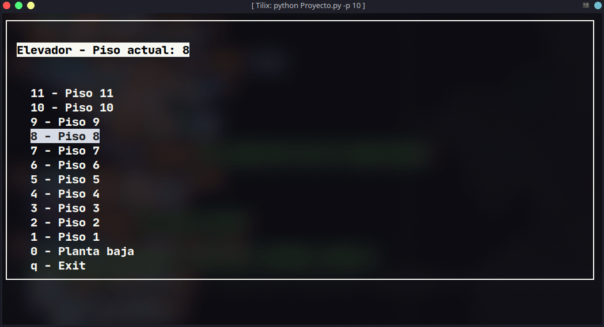

# Proyecto final Lenguajes Formales y Autómatas

## Simulación de un elevador con un autómata finíto determinístico

Uso: 
    
    python .\Proyecto.py

Si se quieren agregar más de 5 pisos (por defecto), usar el siguiente
argumento adicional:

    python .\Proyecto.py -p <Número de pisos>

o

    python .\Proyecto.py --pisos <Número de pisos>

## Demostración

